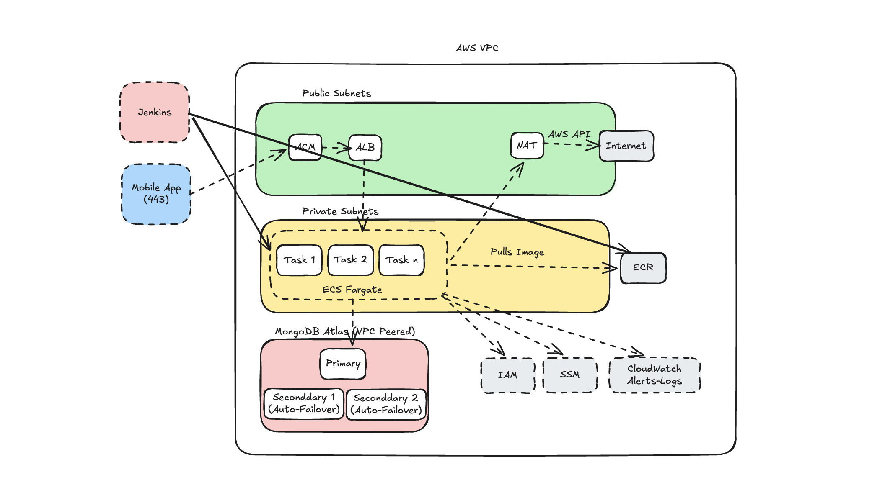

# Cloud Eagle

# TASK 1
The CI/CD pipeline automates the entire deployment lifecycle from code commit to production release, ensuring reliability through automated testing, approval gates, and rollback mechanisms.

## Pipeline Stages

The pipeline consists of the following stages:

1.  **Checkout**: Clones the repository and determines the deployment environment based on the branch name.
    - `develop` : `qa`
    - `release/*` : `staging`
    - `main` : `prod`

2.  **Build & Test**: Compiles the Java code and runs automated tests.
    - Uses `./mvnw clean verify` for testing.
    - Generates JUnit and JaCoCo reports.

3.  **Docker Build**: Builds a Docker image with the new version.

4.  **Push Image**: Pushes the Docker image to Amazon ECR.

5.  **Approval**: Pauses the pipeline for manual approval before deploying to Staging or Production.

6.  **Deploy**: Deploys the new image to the target environment.
    - Fetches the target EC2 host from AWS SSM.
    - Runs the `deploy.py` script on the EC2 instance.

7.  **Smoke Test**: Runs automated smoke tests to validate the deployment.
    - If tests fail, it triggers an automatic rollback.
    - If tests pass, it updates the `last-stable-tag` in S3.

## Deployment Scripts

The pipeline relies on two Python scripts located in the `scripts/` directory:

- **`deploy.py`**: Handles the actual deployment logic for both Rolling and Blue/Green strategies.
- **`smoke_test.py`**: Executes health checks and basic validation after deployment.
- **`rollback.py`**: Executes rollback logic for both Rolling and Blue/Green strategies.

## Answers to a Few Questions as shared in the Google Doc:

1.  **What's the branching strategy?**

    a. How am I mapping branches to environments?
    - **`develop`**: For development work. Triggers QA deployments.
    - **`release/*`**: For release candidates. Triggers Staging deployments.
    - **`main`**: For production releases. Triggers Production deployments.
    - **Other branches** (e.g., feature branches): Are not deployed.

    b. How am I avoiding accidental prod deployments?
    - Every staging, prod env specific deployments need a manual approval gate. Without the manual approval, no deployment can happen in these environments hence avoiding accidental deployments.

2.  **What's the Jenkins Pipeline?**

    a. High Level stages
    - Already shared above in the "Pipeline Stages" section.

    b. What happens on PR vs Merge?
    - Whenever a PR is raised, nothing happens. I believe there's no need to fire Jenkins pipeline whenever a PR is raised but if we wish to do so, then we could using Jenkinsfile triggers and adding Github webhook.
    - Whenever a PR is merged to develop/release/main/feature branch, Jenkins pipeline gets triggered.
        - **`feature/*`**: Only the Build & Test stage gets triggered.
        - **`develop`**: Build & Test -> Docker Build -> Push Image -> Deploy -> Smoke Test stages get triggered. The deployment is a Rolling one.
        - **`release`**: Build & Test -> Docker Build -> Push Image -> Approval -> Deploy -> Smoke Test stages get triggered. The deployment is a Rolling one.
        - **`main`**: Build & Test -> Docker Build -> Push Image -> Approval -> Deploy -> Smoke Test stages get triggered. The deployment is a Blue/Green one.

    c. How am I handling rollbacks?
        - **`feature`**: No rollbacks since no deployment happens in this branch.
        - **`develop, release`**: If smoke test fails, it triggers an automatic rolling rollback to the previous stable tag.
        - **`main`**: If smoke test fails, it triggers an automatic blue/green rollback to the previous stable tag.
        - Please refer `scripts/rollback.py` for more details.
        
3.  **What's the Configuration Management strategy?**

    - Environment-specific configuration is never committed to the repository. All config values live in AWS SSM Parameter Store under a namespaced path per environment. For eg:
        - /sync-service/{env}/ec2-host
        - /sync-service/{env}/mongo-uri
        - /sync-service/prod/blue-tg-arn
        - /sync-service/prod/green-tg-arn
    The Jenkinsfile fetches these at runtime using env.DEPLOY_ENV as the path segment.

    - Spring Boot config is provisioned once on each EC2 instance at setup time using the user data script (bootstrap script).

    - MongoDB credentials are stored as SSM Parameter Store. Each EC2 instance has an IAM Role that restricts it to reading only its own environment's parameters. So, a QA EC2 cannot read Prod EC2's MongoDB creds.

    - Jenkins credentials (SSH keys for EC2 access, AWS account ID) are stored in the Jenkins Credential Store and injected only at the stage that needs them.

    - ECR authentication requires no stored credential at all so the Jenkins EC2 has an IAM Instance Role with ECR push permissions.

4. **What's the Deployment Strategy?**

    - Recreate:
        - **Not going with this strategy at all** at all because it has a guaranteed downtime since the gap between stop and start is dead time.
    
    - Rolling:
        - **Only for qa, staging** envs because downtime is acceptable as this strategy replaces instances one at a time while others keep serving traffic.
    
    - Blue/Green:
        - **Only for prod** env because downtime is not acceptable as this strategy replaces all instances at once and then switches traffic from old to new. If something goes wrong, it instantly rolls back to previous image. Extra infra setup is needed but is worth the cost.

        
    
# TASK 2

**NOTE**: The architecture is in AWS because I am more familiar with AWS components than GCP. Due to the timing constraints, I've formed the architecture using AWS but the same can be replicated in GCP using the equivalent components.

## Components Involved:

1. **VPC**:
    - 1 CIDR block: 10.0.0.0/16
    - 4 Subnets across 2 AZs
        - 2 Public Subnets (for ALB):
            - Public AZ-a
            - Public AZ-b
        - 2 Private Subnets (for ECS Tasks):
            - Private AZ-a
            - Private AZ-b

2. **ACM Certificate**: 
    - In order to have a secure connection, we need to create a HTTPS connection between the client and the host. This is achieved using ACM Certificate.
    - The TLS handshake happens at eh ALB via HTTPS which presents the ACM certificate. The encrypted tunnel is established between phone and the ALB. The traffic between ALB and ECS tasks is unencrypted. This is acceptable because the ALB and ECS tasks are in the same private network.

3. **ALB**: 
    - ALB is a load balancer that distributes traffic across multiple ECS tasks. It is placed in the public subnets and has a public IP address. It is also the entry point for all traffic to the application.
    - Listeners:
        - HTTPS: 443 -> Forwards to ECS tasks after decrytping the request using ACM certificate.
        - HTTP: 80 -> Redirects to HTTPS: 443
    - Security Groups:
        - Inbound: 0.0.0.0/0 -> HTTPS: 443, HTTP: 80
        - Outbound: ECS tasks

4. **NAT Gateway:**
    - NAT Gateway is used to provide internet access to the ECS tasks in the private subnets. It is placed in the public subnets and has a public IP address. It is also the entry point for all traffic from the ECS tasks to the internet and other AWS services.
    - 2 NATs per AZ for high availability with the route tables of private subnets pointing to the NAT Gateway in the same AZ.

5. **ECR**:
    - AWS Docker Registry

6. **IAM**:
    - AWS Permission Management System
    - ECS Task role needed to access SSM Parameter Store and ECR.
    - Jenkins Deploy role needed to ECR and ECS tasks.

7. **SSM Parameter Store**:
    - AWS Systems Manager Parameter Store is a service that lets you store configuration data and secrets as key-value pairs.

8. **ECS Fargate** (Important):
    - ECS Fargate (~ GKE Autopilot with lesser visibility) is a compute engine for Amazon ECS that allows you to run containers without having to manage servers. It is a serverless compute engine that allows you to run containers without having to manage servers. 
    - It fits our solution because:
        - No need of infra team. No servers to patch, no AMIs, no SSH as AWS manages the host entirely
        - Auto Scaling adjusts task count automatically. Scaling can be done easily by setting the min/max tasks.
        - Security is built-in. Tasks run in private subnets with no direct internet access. Security groups control traffic.        
    - Why not EKS? (~GKE)
        - EKS can cost too much and is an overkill for running just one service
        - Kubernetes brings in a lot of operational complexity and overhead which isn't needed as per now.
    - Why not EC2? (~GCP Compute Engine)
        - That's a lot of infrastructure overhead to manage if we just choose to deploy a single service.
        - We'll need to configure auto-scaling, load balancing, health checks, AMIs, etc. manually.
    - Why not Cloud Run?
        - As per my research, Cloud Run is kind of similar to AWS Lambda. It is a serverless platform that allows you to run containers without having to manage servers. 
        - It has a cold-start problem which means Cloud Run will spin the container down after inactivity and restart it on the next request. That first request after idle gets a timeout instead of a response.
        - Cloud Run's model of spinning instances up/down constantly means we're re-establishing the pool connection again and again whereas Fargate could keep the connection alive always.
        
9. **Cloud Watch**:
    - AWS Observability and monitoring tool for logs, alerts, metrics, dashboards, etc.

10. **MongoDB Atlas** (VPC Peered with Pvt Subnets ECS Tasks):
    - Fully Managed AWS MongoDB service. If Primary node goes down during any Spring Boot write async operation then MongoDB Atlas could elect a Secondary node as the new Primary Node avoiding data loss.
    

**Closing Thought for Improvement**:
- We could also use a GitOps Tool like ArgoCD to better handle deployments. It could help us directly deploy to ECS hence giving us more visibility and control over the deployment process. It also adds an extra layer for syncing processes between Git and ECS.
- More about this tool: https://argo-cd.readthedocs.io/en/stable/